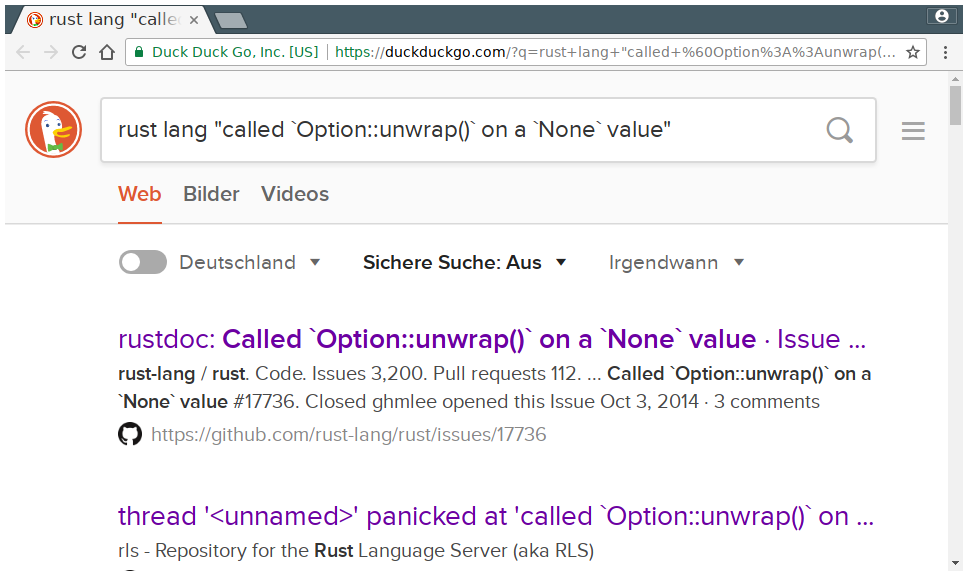

[](https://crates.io/crates/panic_search)

[](https://docs.rs/panic_search)

```rust
extern crate panic_search;

fn main() {
    panic_search::enable();

    None::<i32>.unwrap();
}
```

⬇️ ⬇️ ⬇️ ⬇️ ⬇️ ⬇️ ⬇️ ⬇️ ⬇️ ⬇️ ⬇️ ⬇️ ⬇️ ⬇️ ⬇️ ⬇️


